[](http://makeapullrequest.com)  
# Mario-PPO
## 29 / 32 Levels Completed (**Let the page to be fully loaded**)!

<p align="left">
  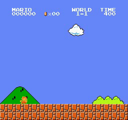
  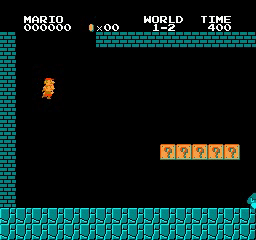
  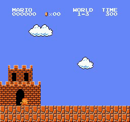
  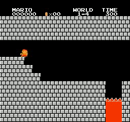<br/>
  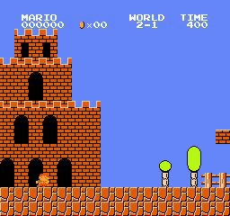
  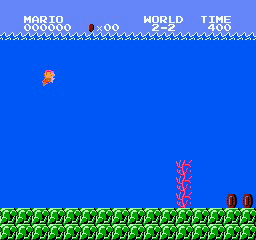
  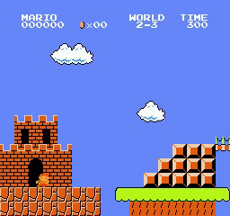
  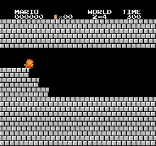<br/>
  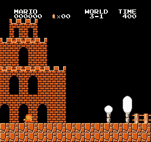
  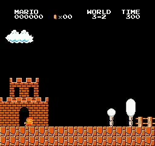
  
  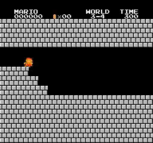<br/>
  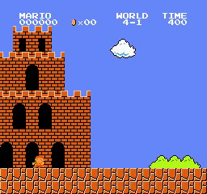
  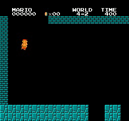
  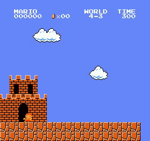<br/>
  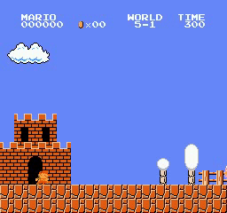
  
  
  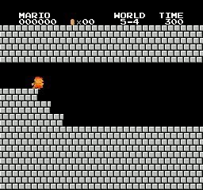<br/>
  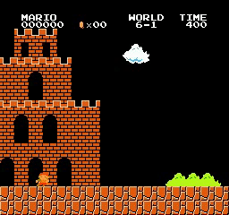
  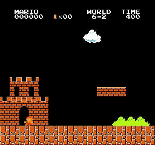
  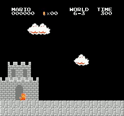
  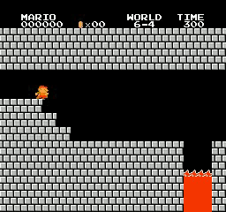<br/>
  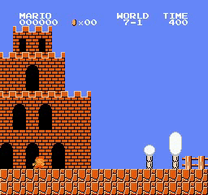
  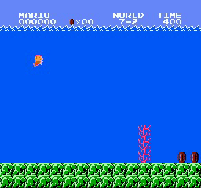
  <br/>
  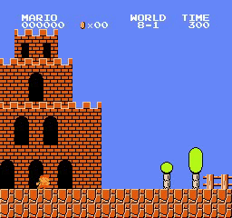
  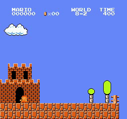
  <br/>
</p>

## Usage

- **First, Don't forget to insert your [comet.ml](https://www.comet.ml) configurations in this line**:  
```python
experiment = Experiment() # Add your Comet configs!
```
### How to run

```bash
usage: main.py [-h] [--world WORLD] [--stage STAGE]
               [--total_iterations TOTAL_ITERATIONS] [--interval INTERVAL]
               [--do_train] [--render] [--train_from_scratch]

Variable parameters based on the configuration of the machine or user's choice

optional arguments:
  -h, --help            show this help message and exit
  --world WORLD         The id number of the mario world.
  --stage STAGE         The id number of the mario world's stage.
  --total_iterations TOTAL_ITERATIONS
                        The total number of iterations.
  --interval INTERVAL   The interval specifies how often different parameters
                        should be saved and printed, counted by iterations.
  --do_train            The flag determines whether to train the agent or play
                        with it.
  --render              The flag determines whether to render each agent or
                        not.
  --train_from_scratch  The flag determines whether to train from scratch or
                        continue previous tries.
```

- **In order to train the agent with your choice of world and stage (`do_train` flag changes the mode of _training_ to _testing_ the agent)**:
```shell
python3 main.py --world=2 --stage=2
```
- **If you want to keep training your previous run, execute the following:**
```shell
python3 main.py --world=2 --stage=2 --train_from_scratch
```
### Hardware requirements
- **The whole training procedure was done on Quadro P5000 on [paperspace.com](https://www.paperspace.com/) thus, a machine with similar configuration would be sufficient**.

## Documented Hyper-Parameters fo different worlds (W) and stages (S)
> I forgot to document hyper-parameters for all environments on [comet.ml](https://www.comet.ml). 😅

W-S| T| n_epochs| batch_size| lr| gamma| lambda| ent_coeff| clip_range| n_workers| grad_clip_norm 
:---:|:---:|:---:|:--------:|:---:|:----:|:---:|:--------:|:---------:|:--------:|:--------------:
1-1  | 128 | 8   |      64  |2.5e-4| 0.9| 0.95 |  0.01    |      0.2  |        8 |       0.5
1-2  | 128 | 8   |      64  |2.5e-4| 0.9| 0.95 |  0.01    |      0.2  |        8 |       0.5
2-2  | 128 | 10  |      32  |2.5e-4| 0.9| 0.95 |  0.01    |      0.2  |        8 |  No Clipping
3-1  | 128 | 4   |      64  |2.5e-4| 0.9| 0.95 |  0.01    |      0.2  |        8 |  No Clipping
3-2  | 128 | 4   |      64  |2.5e-4| 0.9| 0.95 |  0.01    |      0.2  |        8 |  No Clipping
3-3  | 128 | 8   |      64  |1e-4  | 0.9| 0.95 |  0.01    |      0.1  |        8 |        1
3-4  | 128 | 8   |      64  |1e-4  | 0.9| 0.95 |  0.01    |      0.1  |        8 |        1
4-1  | 128 | 8   |      64  |1e-4  | 0.9| 0.95 |  0.01    |      0.1  |        8 |        1
4-2  | 128 | 8   |      64  |1e-4  | 0.95| 0.95|  0.01    |      0.2  |        8 |  No Clippiing
4-3  | 128 | 8   |      64  |2.5e-4| 0.97| 0.95|  0.01    |      0.2  |        8 |  	 0.5
5-1  | 128 | 8   |      64  |2.5e-4| 0.97| 0.95|  0.01    |      0.2  |        8 |  	 0.5
5-2  | 128 | 8   |      64  |2.5e-4| 0.97| 0.95|  0.01    |      0.2  |        8 |  	 0.5
5-3  | 128 | 8   |      64  |2.5e-4| 0.98| 0.98|  0.03    |      0.2  |        8 |  	 0.5
6-1  | 128 | 8   |      64  |2.5e-4| 0.9 | 0.95|  0.01    |      0.2  |        8 |  	 0.5
6-2  | 128 | 8   |      64  |2.5e-4| 0.9 | 0.95|  0.01    |      0.2  |        8 |  	 0.5
6-3  | 128 | 8   |      64  |2.5e-4| 0.98| 0.98|  0.03    |      0.2  |        8 |  	 0.5
6-4  | 128 | 8   |      64  |2.5e-4| 0.9 | 0.95|  0.01    |      0.2  |        8 |  	 0.5
7-1  | 128 | 8   |      64  |2.5e-4| 0.9 | 0.95|  0.01    |      0.2  |        8 |  	 0.5
7-2  | 128 | 8   |      64  |2.5e-4| 0.9 | 0.95|  0.01    |      0.2  |        8 |  	 0.5
7-3  | 128 | 8   |      64  |2.5e-4| 0.9 | 0.95|  0.01    |      0.2  |        8 |  	 0.5
8-1  | 128 | 8   |      64  |2.5e-4| 0.9 | 0.95|  0.01    |      0.2  |        8 |  	 0.5
8-2  | 128 | 8   |      64  |2.5e-4| 0.9 | 0.95|  0.01    |      0.2  |        8 |  	 0.5
8-3  | 128 | 8   |      64  |2.5e-4| 0.9 | 0.95|  0.01    |      0.2  |        8 |  	 0.5         

- For world 4 - stage 2, the effect of the game score was not used since it distracts Mario from his original goal which is reaching the flag.


## Acknowledgment
1. [@OpenAI](https://github.com/openai) for [Mario Wrapper](https://github.com/openai/large-scale-curiosity/blob/e0a698676d19307a095cd4ac1991c4e4e70e56fb/wrappers.py#L241).
2. [@uvipen](https://github.com/uvipen) for [Super-mario-bros-PPO-pytorch](https://github.com/uvipen/Super-mario-bros-PPO-pytorch).
3. [@roclark](https://github.com/roclark) for [Mario Reward](https://github.com/roclark/super-mario-bros-dqn/blob/2305549fe4a2eb273d98c3811b809bd9360e024a/core/wrappers.py#L110).
